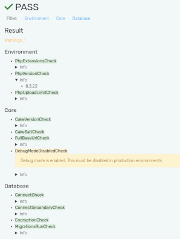
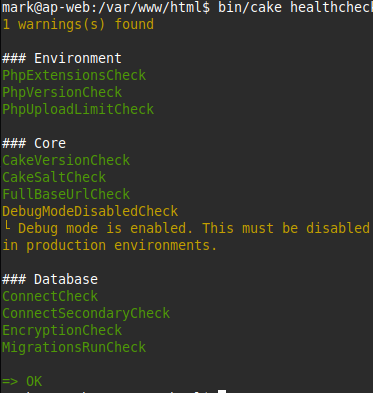

# Healthcheck Documentation
This plugin provides a healthcheck stack that can be used to check the status
of your application and its services.

<table style="vertical-align: top">
    <tr>
        <td>Web</td>
        <td>CLI</td>
    </tr>
    <tr>
        <td>
            <a href="screenshot_web_full.png"></a>
        </td>
        <td>
            
        </td>
    </tr>
</table>

With -v in CLI you can also see all the info details.

## Config/Setup
The simplest way is to use Configure `Setup.Healthcheck.checks`:
```php
'Setup' => [
    'Healthcheck' => [
        'checks' => [
            \Setup\Healthcheck\Check\Environment\PhpVersionCheck::class,
            \Setup\Healthcheck\Check\Core\CakeVersionCheck::class,
            // ...
        ],
    ],
],
```
Once defined, this will replace the defaults.
You can also use the `Setup.Healthcheck.checks` config to add your own checks.

To only replace the ones you need, you can also merge with the defaults:
```php
'Setup' => [
    'Healthcheck' => [
        'checks' => [
            \Setup\Healthcheck\Check\Environment\PhpUploadLimitCheck::class => [
                'min' => 64,
            ],
            // ...
        ] + \Setup\Healthcheck\HealthcheckCollector::defaultChecks(),
    ],
],
```
If you need to pass configs to the checks, make sure the value is an array with the keys matching the param names.

You can also pass the instance of the check class instead of the class name as a string if needed:
```php
'Setup' => [
    'Healthcheck' => [
        'checks' => [
            new \Setup\Healthcheck\Check\Core\CakeVersionCheck(
                overrideComparisonChar: '^',
            ),
            // ...
        ],
    ],
],
```

You can set a priority (1...10) for each check to control the order of execution.
```php
    protected int $priority = 6;
```
The higher (towards 1), the earlier it will be executed.

If you want to set a specific scope, you can do that by either adjusting the property directly, or set the method.
The latter is needed for a dynamic scope through closure:
```php
    /**
     * @return array<string|callable>
     */
    public function scope(): array {
        return [
            // Only run in debug mode
            function () {
                return Configure::read('debug');
            },
        ];
    }
```

In case you need to adjust an existing check at runtime, you need to instantiate it first:
```php
$check = new \Setup\Healthcheck\Check\Core\CakeVersionCheck();
$check
    ->adjustPriority(6)
    ->adjustScope([...]);
```

## Usage

You can use the healthcheck stack by accessing the `/setup/healthcheck` endpoint in your application.
In debug mode you can see the issues in detail. In production mode, only the status is shown.

For CLI you can run the command:
```bash
bin/cake healthcheck
```

You can also write a queue task to run the healthcheck periodically and log the results or
on errors directly alert the admin(s).
Using [QueueScheduler plugin](https://github.com/dereuromark/cakephp-queue-scheduler) you can directly
add a scheduled task for it in the backend, e.g. every hour.

## Default Checks

The following checks are included by default:

### Environment Checks
- **PhpVersionCheck**: Validates PHP version meets requirements
- **PhpExtensionsCheck**: Checks required PHP extensions are loaded
- **PhpUploadLimitCheck**: Validates upload_max_filesize setting
- **MemoryLimitCheck**: Checks PHP memory_limit is adequate
- **MaxExecutionTimeCheck**: Validates max_execution_time setting
- **MaxInputVarsCheck**: Checks max_input_vars limit
- **TimezoneCheck**: Validates timezone configuration
- **OpcacheEnabledCheck**: Checks OPcache is enabled in production
- **RealpathCacheCheck**: Validates realpath cache settings
- **XdebugDisabledCheck**: Warns if Xdebug is enabled in production
- **AssertionsCheck**: Checks assertion settings for production
- **PhpErrorDisplayCheck**: Validates display_errors is off in production
- **ExposePhpCheck**: Checks expose_php is disabled
- **AllowUrlIncludeCheck**: Validates allow_url_include is off
- **DisableFunctionsCheck**: Checks dangerous functions are disabled

### Core/Application Checks
- **CakeVersionCheck**: Validates CakePHP version
- **CakeSaltCheck**: Ensures security salt is properly configured
- **FullBaseUrlCheck**: Validates App.fullBaseUrl configuration
- **DebugModeDisabledCheck**: Warns if debug mode is on in production
- **DebugKitDisabledCheck**: Checks DebugKit is disabled in production
- **SessionLifetimeCheck**: Validates session lifetime settings
- **SessionCleanupCheck**: Checks session garbage collection settings
- **FilePermissionsCheck**: Validates tmp/ and logs/ are writable
- **ComposerOptimizationCheck**: Checks composer autoloader is optimized
- **SecurityHeadersCheck**: Validates security-related HTTP headers
- **CookieSecurityCheck**: Checks cookie security settings (Secure, HttpOnly, SameSite)

### Database Checks
- **ConnectCheck**: Validates database connection
- **DatabaseCharsetCheck**: Checks database charset/collation settings

## Creating Custom Checks

You can create your own checks by implementing `Setup\Healthcheck\Check\CheckInterface`:

```php
namespace App\Healthcheck\Check;

use Setup\Healthcheck\Check\AbstractCheck;
use Setup\Healthcheck\HealthcheckResult;

class MyCustomCheck extends AbstractCheck {

    public function run(): HealthcheckResult {
        // Your check logic here
        if ($everythingOk) {
            return HealthcheckResult::success('All good!');
        }

        return HealthcheckResult::error('Something is wrong');
    }

    public function name(): string {
        return 'My Custom Check';
    }

    public function domain(): string {
        return 'Application';
    }

}
```

Then add it to your configuration:
```php
'Setup' => [
    'Healthcheck' => [
        'checks' => [
            \App\Healthcheck\Check\MyCustomCheck::class,
        ] + \Setup\Healthcheck\HealthcheckCollector::defaultChecks(),
    ],
],
```

