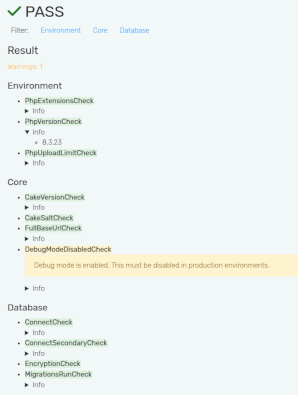
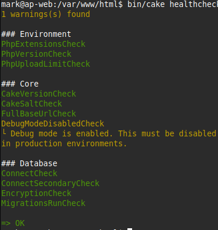

# Healthcheck

The plugin provides a healthcheck stack that you can use to check the status of
your application and its services. It runs both from the web and from the CLI.

| Web | CLI |
|-----|-----|
| [](./screenshot_web_full.png) |  |

With `-v` in CLI you can also see all the detail information.

## Configuration

The simplest way to configure the checks is via the `Setup.Healthcheck.checks`
Configure key:

```php
'Setup' => [
    'Healthcheck' => [
        'checks' => [
            \Setup\Healthcheck\Check\Environment\PhpVersionCheck::class,
            \Setup\Healthcheck\Check\Core\CakeVersionCheck::class,
            // ...
        ],
    ],
],
```

Once defined, this replaces the defaults. You can also use the
`Setup.Healthcheck.checks` config to add your own checks.

### Merging with the defaults

To replace only the ones you need, merge with the defaults:

```php
'Setup' => [
    'Healthcheck' => [
        'checks' => [
            \Setup\Healthcheck\Check\Environment\PhpUploadLimitCheck::class => [
                'min' => 64,
            ],
            // ...
        ] + \Setup\Healthcheck\HealthcheckCollector::defaultChecks(),
    ],
],
```

If you need to pass config to a check, make sure the value is an array whose keys
match the parameter names.

### Passing instances

You can pass an instance of a check class instead of the class-name string when
needed:

```php
'Setup' => [
    'Healthcheck' => [
        'checks' => [
            new \Setup\Healthcheck\Check\Core\CakeVersionCheck(
                overrideComparisonChar: '^',
            ),
            // ...
        ],
    ],
],
```

### Priority

You can set a priority (1...10) for each check to control the execution order:

```php
    protected int $priority = 6;
```

The higher the priority (towards 1), the earlier the check runs.

### Level

Checks default to `error`. Use `adjustLevel()` to select `error`, `warning`, or
`info`. A failed warning-level check increases the warning count but does not
make the healthcheck fail.

### Scope

If you want to set a specific scope, adjust the property directly or define the
method. The method form is needed for a dynamic scope through a closure:

```php
    /**
     * @return array<string|callable>
     */
    public function scope(): array {
        return [
            // Only run in debug mode
            function () {
                return Configure::read('debug');
            },
        ];
    }
```

### Adjusting checks at runtime

To adjust an existing check at runtime, instantiate it first:

```php
$check = new \Setup\Healthcheck\Check\Core\CakeVersionCheck();
$check
    ->adjustPriority(6)
    ->adjustScope([...])
    ->adjustLevel(\Setup\Healthcheck\Check\CheckInterface::LEVEL_WARNING)
    ->adjustCacheTtl(30);
```

## Usage

Access the `/setup/healthcheck` endpoint in your application to view the
healthcheck. In debug mode you can see issues in detail; in production mode only
the status is shown.

For CLI, run the command:

```bash
bin/cake healthcheck
```

::: tip Scheduled monitoring
You can write a queue task to run the healthcheck periodically — logging the
results or alerting the admins directly on errors. With the
[QueueScheduler plugin](https://github.com/dereuromark/cakephp-queue-scheduler)
you can add a scheduled task for it from the backend, for example every hour.
:::

## Caching

Caching is disabled by default. Set `Setup.Healthcheck.cache` to the name of a
configured CakePHP cache. A null or empty value disables caching.
`Setup.Healthcheck.cacheTtl` defaults to 60 seconds and applies to each check.

```php
'Setup' => [
    'Healthcheck' => [
        'cache' => 'default',
        'cacheTtl' => 60,
    ],
],
```

For checks extending `Check`, use `adjustCacheTtl(30)` to override the TTL,
`adjustCacheTtl(0)` to disable caching for that check, or `adjustCacheTtl(null)`
to inherit the configured default. Other `CheckInterface` implementations are
never cached. Results are stored as plain arrays, without scope closures.
CLI and web results use separate cache keys because their PHP settings can differ.
A key covers the check class and its configuration (constructor options, level,
priority, TTL), so differently configured instances never share a result.
`SecurityHeadersCheck` is never cached by default because its result depends on
the current request (HTTPS, sent headers).

Use `?refresh=1` to run fresh checks in debug mode or on the admin endpoint.
The public production endpoint ignores this parameter. From the CLI, use
`bin/cake healthcheck --no-cache`. Both bypasses update the cache with fresh
results. Call `Healthcheck::clearCache()` to delete results for the current SAPI.

Detailed JSON results include `cached` for each check and `cached_at` as an
ISO 8601 timestamp when a cached result is used.

## Default checks

The following checks are included by default.

### Environment checks

- **PhpVersionCheck**: Validates the PHP version meets requirements.
- **PhpExtensionsCheck**: Checks that required PHP extensions are loaded.
- **PhpUploadLimitCheck**: Validates the `upload_max_filesize` setting.
- **MemoryLimitCheck**: Checks that the PHP `memory_limit` is adequate.
- **MaxExecutionTimeCheck**: Validates the `max_execution_time` setting.
- **MaxInputVarsCheck**: Checks the `max_input_vars` limit.
- **TimezoneCheck**: Validates the timezone configuration.
- **OpcacheEnabledCheck**: Checks that OPcache is enabled in production.
- **RealpathCacheCheck**: Validates the realpath cache settings.
- **XdebugDisabledCheck**: Warns if Xdebug is enabled in production.
- **AssertionsCheck**: Checks assertion settings for production.
- **PhpErrorDisplayCheck**: Validates that `display_errors` is off in production.
- **ExposePhpCheck**: Checks that `expose_php` is disabled.
- **AllowUrlIncludeCheck**: Validates that `allow_url_include` is off.
- **DisableFunctionsCheck**: Checks that dangerous functions are disabled.

### Core/application checks

- **CakeVersionCheck**: Validates the CakePHP version.
- **CakeSaltCheck**: Ensures the security salt is properly configured.
- **CakeCacheCheck**: Validates that cache configurations are set up.
- **FullBaseUrlCheck**: Validates the `App.fullBaseUrl` configuration.
- **DebugModeDisabledCheck**: Warns if debug mode is on in production.
- **DebugKitDisabledCheck**: Checks that DebugKit is disabled in production.
- **SessionLifetimeCheck**: Validates session lifetime settings.
- **SessionCleanupCheck**: Checks session garbage-collection settings.
- **FilePermissionsCheck**: Validates that `tmp/` and `logs/` are writable.
- **ComposerOptimizationCheck**: Checks that the Composer autoloader is optimized.
- **SecurityHeadersCheck**: Validates security-related HTTP headers.
- **CookieSecurityCheck**: Checks cookie security settings (Secure, HttpOnly, SameSite).

### Database checks

- **ConnectCheck**: Validates the database connection.
- **DatabaseCharsetCheck**: Checks the database charset/collation settings.

## Opt-in checks

The following checks are available but not enabled by default, due to specific
requirements or potential side effects.

### Environment checks

- **DiskSpaceCheck**: Monitors disk usage with configurable thresholds (warning at
  80%, error at 95%). Not enabled by default because disk paths and thresholds are
  environment-specific.

```php
'Setup' => [
    'Healthcheck' => [
        'checks' => [
            \Setup\Healthcheck\Check\Environment\DiskSpaceCheck::class => [],
            // Or with custom thresholds and paths:
            \Setup\Healthcheck\Check\Environment\DiskSpaceCheck::class => [
                'warningThresholdPercent' => 70,
                'errorThresholdPercent' => 90,
            ],
        ] + \Setup\Healthcheck\HealthcheckCollector::defaultChecks(),
    ],
],
```

### Network checks

- **SslCertificateExpiryCheck**: Checks the SSL certificate expiry for the
  application's host. Web-only (not available in CLI). Not enabled by default
  because it requires network access and may not apply to local/non-SSL
  environments.

```php
'Setup' => [
    'Healthcheck' => [
        'checks' => [
            \Setup\Healthcheck\Check\Network\SslCertificateExpiryCheck::class => [],
            // Or with custom thresholds:
            \Setup\Healthcheck\Check\Network\SslCertificateExpiryCheck::class => [
                'warningDays' => 60,
                'errorDays' => 14,
                'host' => 'api.example.com',
            ],
        ] + \Setup\Healthcheck\HealthcheckCollector::defaultChecks(),
    ],
],
```

## Creating custom checks

Extend `Setup\Healthcheck\Check\Check` and implement `check(): void`.
Set `$this->passed` and append messages to `$this->failureMessage`,
`$this->warningMessage`, `$this->successMessage`, or `$this->infoMessage`.
A passed check with warning messages is treated as a warning-level failure.

This example checks a database connection:

```php
namespace App\Healthcheck\Check\Application;

use Cake\Datasource\ConnectionManager;
use Exception;
use Setup\Healthcheck\Check\Check;

class MyCustomCheck extends Check {

    public const INFO = 'Checks if the default database can be connected to.';

    public function check(): void {
        try {
            $connection = ConnectionManager::get('default');
            $connection->getDriver()->connect();
            $this->passed = true;
            $this->successMessage[] = 'Connected to the default database.';
        } catch (Exception $exception) {
            $this->passed = false;
            $this->failureMessage[] = 'Cannot connect to the default database: ' . $exception->getMessage();
        }
    }

}
```

By default, `name()` returns the class name (`MyCustomCheck`) and `domain()`
returns the last namespace segment (`Application` here). Override either method to
use a different label. The optional `public const INFO` describes the check.

Then add it to your configuration:

```php
'Setup' => [
    'Healthcheck' => [
        'checks' => [
            \App\Healthcheck\Check\Application\MyCustomCheck::class,
        ] + \Setup\Healthcheck\HealthcheckCollector::defaultChecks(),
    ],
],
```

## See also

- [Maintenance Mode](/maintenance/) — whitelist the healthcheck endpoint during maintenance.
- [Uptime](/maintenance/uptime) — a simpler uptime route.
